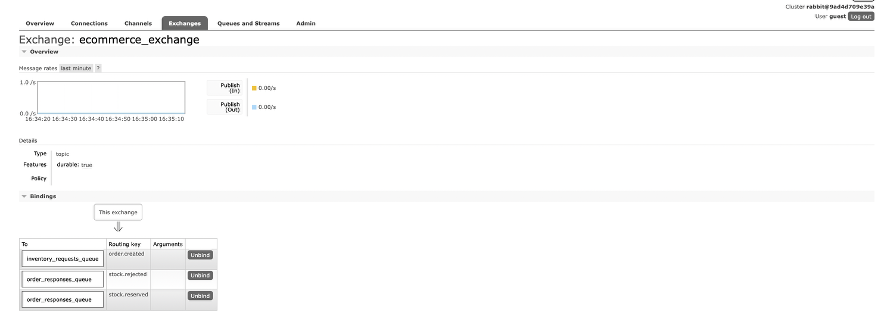
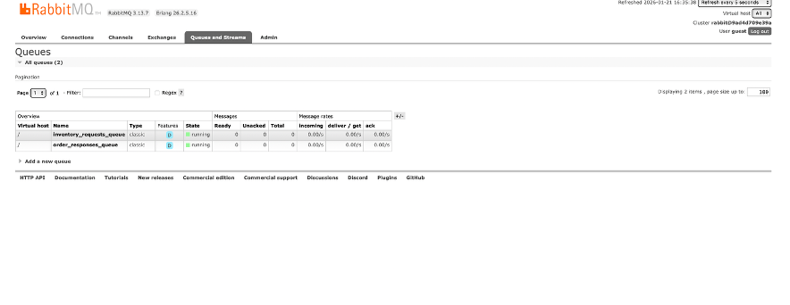
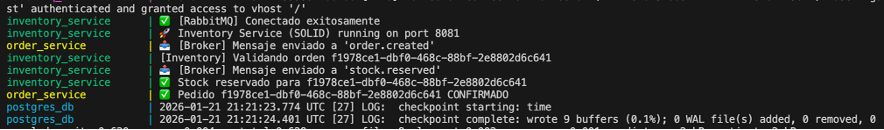
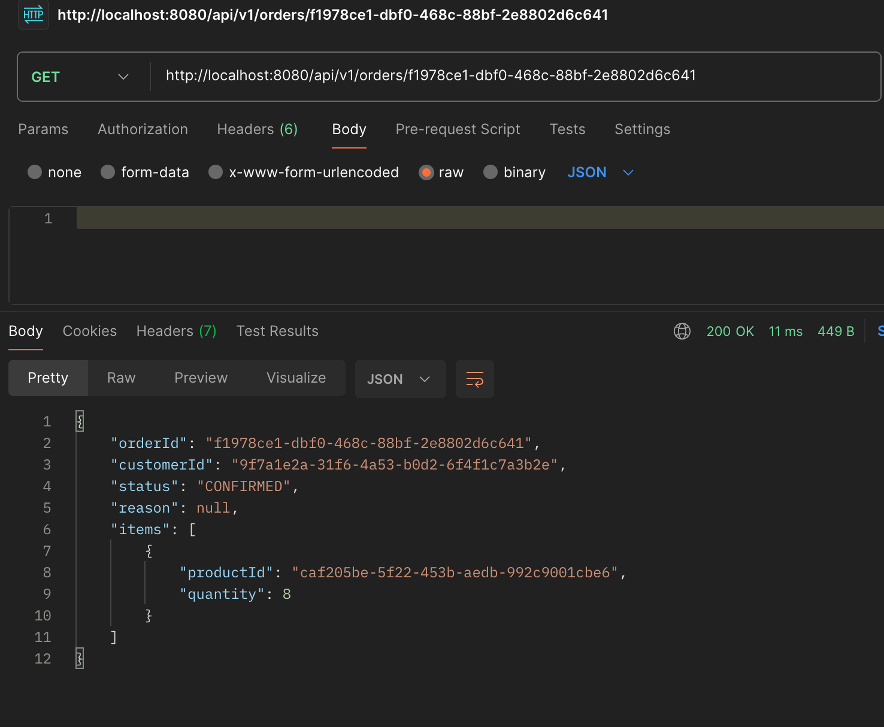
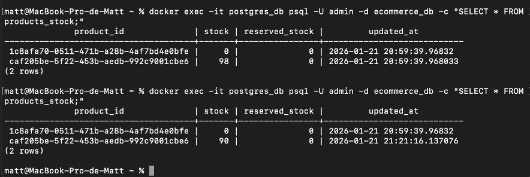
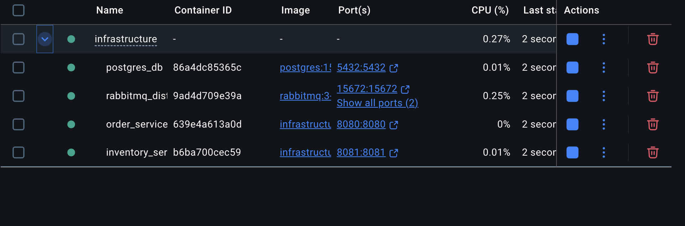
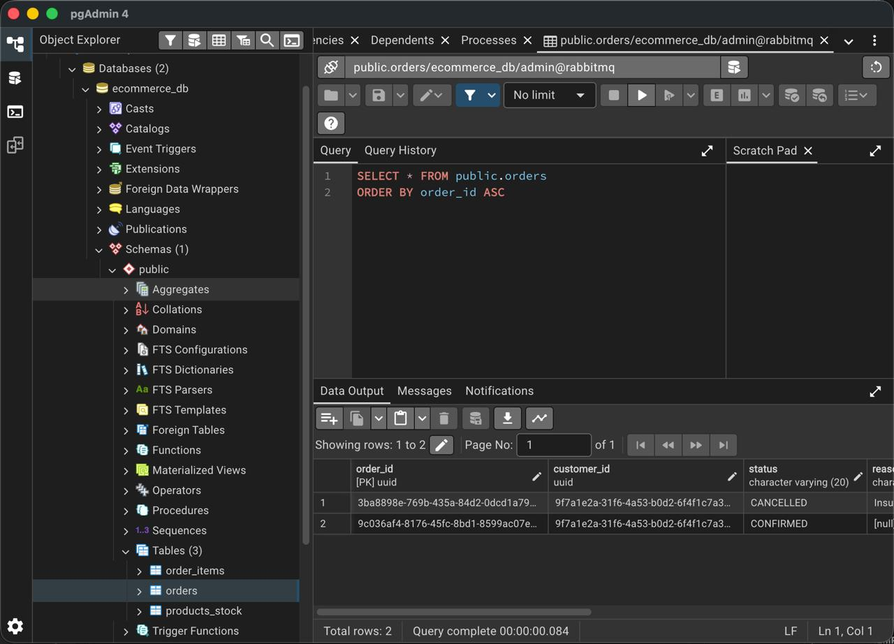
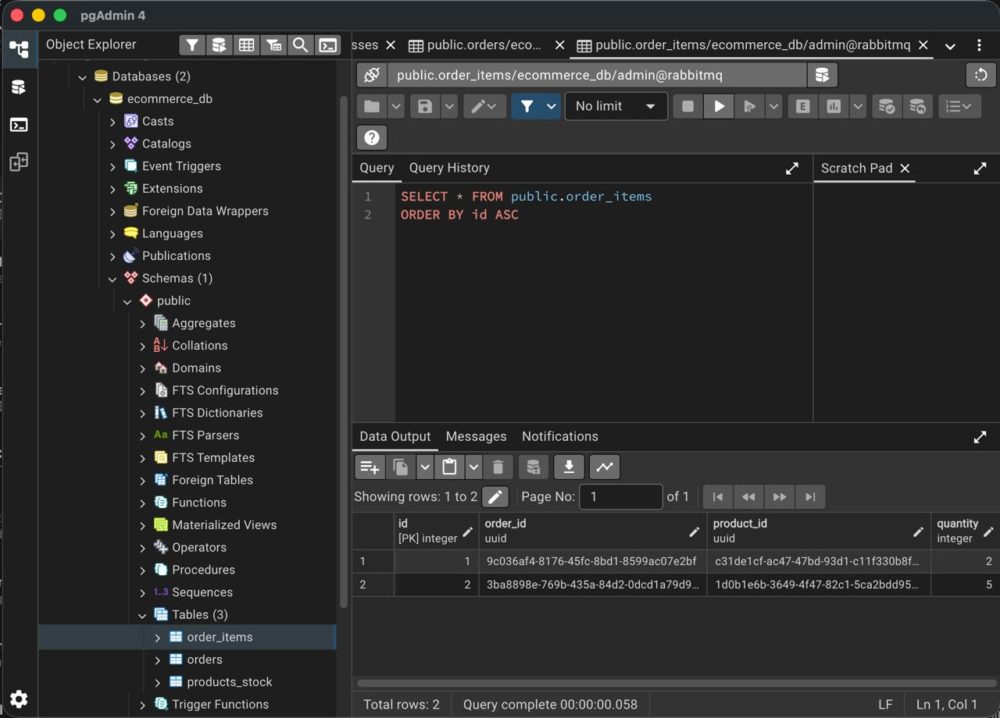
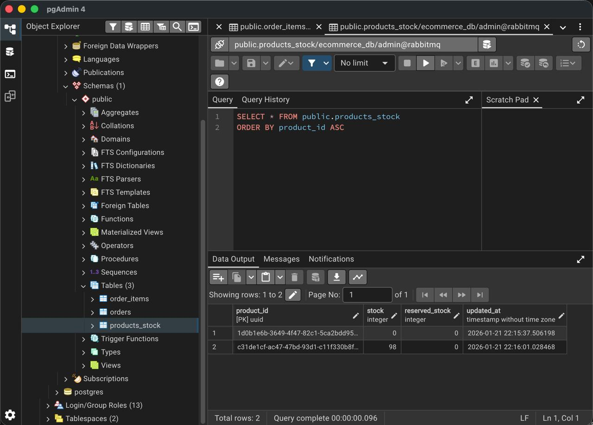

# Sistema de Microservicios E-commerce

Una arquitectura de microservicios orientada por eventos para una plataforma de comercio electrónico utilizando Node.js y RabbitMQ. El sistema garantiza consistencia de datos entre pedidos e inventario mediante comunicación asíncrona de eventos con manejo de transacciones concurrentes.

## Descripción General de la Arquitectura

### Stack Tecnológico

- **Runtime:** Node.js v18
- **Base de Datos:** PostgreSQL 15 (con soporte UUID)
- **Message Broker:** RabbitMQ 3 (AMQP)
- **Contenedorización:** Docker & Docker Compose
- **Patrones de Diseño:** Principios SOLID, Patrón Repository, Inyección de Dependencias, Arquitectura Orientada por Eventos

### Componentes del Sistema

```
┌─────────────────────────────────────────────────────────────┐
│                    Clientes HTTP                            │
└──────────────────────────┬──────────────────────────────────┘
                           │
                    ┌──────▼──────┐
                    │Servicio de  │ (Puerto 8080)
                    │  Pedidos    │
                    │  - Crear    │
                    │  - Consultar│
                    └──────┬──────┘
                           │
        ┌──────────────────┼──────────────────┐
        │                  │                  │
    (Publicar)        (Consumir)         (Consumir)
        │                  │                  │
   order.created   stock.reserved    stock.rejected
        │                  │                  │
        ▼                  │                  │
    ┌───────────────────────────────────────┐
    │    RabbitMQ Message Broker            │
    └─────────────────┬─────────────────────┘
                      │
            ┌─────────┼─────────┐
            │                   │
        (Consumir)         (Publicar)
            │                   │
   order.created       stock.reserved
                       stock.rejected
            │                   │
            ▼                   ▼
    ┌─────────────────────────────────────┐
    │  Servicio de Inventario             │
    │  - Verificar disponibilidad stock   │
    │  - Reservar/Rechazar con DB lock   │
    │  - Emitir eventos                   │
    └────────────────┬────────────────────┘
                     │
            ┌────────▼────────┐
            │   PostgreSQL    │
            │  - Pedidos      │
            │  - Items Pedido │
            │  - Stock Prod.  │
            └─────────────────┘
```

## Flujo de Datos

1. **Solicitud del Cliente:** HTTP POST a `/api/v1/orders` con detalles del pedido
2. **Servicio de Pedidos:** 
   - Valida y crea pedido con estado `PENDING`
   - Publica evento `order.created` en RabbitMQ
3. **Servicio de Inventario:**
   - Consume evento `order.created`
   - Ejecuta transacción atómica con bloqueo de fila en BD (`FOR UPDATE`)
   - Valida disponibilidad de stock para todos los items
4. **Punto de Decisión:**
   - **Stock Disponible:** Decrementa inventario, publica `stock.reserved`
   - **Stock No Disponible:** Publica `stock.rejected` con razón
5. **Servicio de Pedidos:**
   - Consume `stock.reserved` o `stock.rejected`
   - Actualiza estado del pedido a `CONFIRMED` o `CANCELLED`

## Primeros Pasos

### Requisitos Previos

- Docker Desktop o Docker Engine + Docker Compose
- Acceso a terminal/shell

### Instalación

Clona y navega al proyecto:

```bash
git clone <repository-url>
cd RabbitMQ_AppD
```

Inicia todos los servicios:

```bash
docker-compose -f infrastructure/docker-compose.yml up --build
```

Espera el mensaje de confirmación: `[RabbitMQ] Conectado exitosamente`

### Obtener IDs de Productos

El sistema genera automáticamente dos productos con UUIDs aleatorios en la primera ejecución. Consúltalos:

```bash
docker exec -it postgres_db psql -U admin -d ecommerce_db \
  -c "SELECT product_id, stock FROM products_stock;"
```

Recibirás:

| product_id | stock | Uso |
|-----------|-------|-------|
| `uuid-1` | 100 | Pruebas de compra exitosa |
| `uuid-2` | 0 | Pruebas de escenario fallido |

## Referencia de API

### Servicio de Pedidos (Puerto 8080)

**Crear Pedido**
```http
POST /api/v1/orders
Content-Type: application/json

{
  "customerId": "9f7a1e2a-31f6-4a53-b0d2-6f4f1c7a3b2e",
  "items": [
    {
      "productId": "uuid-producto",
      "quantity": 2
    }
  ],
  "shippingAddress": {
    "city": "Quito",
    "street": "Av. Amazonas"
  }
}
```

Respuesta (HTTP 201):
```json
{
  "orderId": "uuid-generado",
  "status": "PENDING",
  "message": "Pedido recibido. Verificación de inventario en progreso.",
  "createdAt": "2026-01-21T22:16:00.990Z"
}
```

**Consultar Estado del Pedido**
```http
GET /api/v1/orders/{orderId}
```

Respuesta (HTTP 200):
```json
{
  "orderId": "uuid",
  "customerId": "uuid",
  "status": "CONFIRMED",
  "items": [...],
  "reason": null
}
```

### Servicio de Inventario (Puerto 8081)

**Verificar Stock**
```http
GET /api/v1/products/{productId}/stock
```

Respuesta (HTTP 200):
```json
{
  "productId": "uuid",
  "availableStock": 98,
  "reservedStock": 0,
  "updatedAt": "2026-01-21T22:16:01.028Z"
}
```

## Escenarios de Prueba

### Escenario 1: Compra Exitosa

Usa UUID de producto con stock (100 unidades). Flujo esperado:

1. POST a `/api/v1/orders` → Retorna `orderId` con estado `PENDING`
2. GET `/api/v1/orders/{orderId}` → Estado cambia a `CONFIRMED`
3. GET `/api/v1/products/{productId}/stock` → Stock disponible decrece a 98

### Escenario 2: Stock Insuficiente

Usa UUID de producto sin stock (0 unidades). Flujo esperado:

1. POST a `/api/v1/orders` → Retorna `orderId` con estado `PENDING`
2. GET `/api/v1/orders/{orderId}` → Estado cambia a `CANCELLED` con razón

## Documentación de Servicios

Para documentación técnica detallada, consulta:

- [Servicio de Pedidos](./order-service/README.md) - Manejo de solicitudes y coordinación de eventos
- [Servicio de Inventario](./inventory-service/README.md) - Gestión de stock y manejo de concurrencia

## Monitoreo y Administración

**Consola de Administración RabbitMQ**
- URL: `http://localhost:15672`
- Credenciales: `guest` / `guest`
- Visualiza exchanges, colas y flujo de eventos

**Acceso a Base de Datos**
```bash
docker exec -it postgres_db psql -U admin -d ecommerce_db
```

## Mantenimiento

Reiniciar base de datos y regenerar UUIDs de productos:

```bash
docker-compose -f infrastructure/docker-compose.yml down -v
docker-compose -f infrastructure/docker-compose.yml up --build
```

Detener servicios:

```bash
docker-compose -f infrastructure/docker-compose.yml down
```

## Estructura del Proyecto

```
RabbitMQ_AppD/
├── infrastructure/
│   ├── docker-compose.yml       # Orquestación de servicios
│   └── init.sql                 # Inicialización de BD
├── order-service/               # Microservicio de gestión de pedidos
│   ├── src/
│   │   ├── server.js
│   │   ├── controllers/
│   │   ├── services/
│   │   ├── domain/
│   │   └── infrastructure/
│   ├── Dockerfile
│   └── package.json
├── inventory-service/           # Microservicio de gestión de stock
│   ├── src/
│   │   ├── server.js
│   │   ├── controllers/
│   │   ├── services/
│   │   ├── domain/
│   │   └── infrastructure/
│   ├── Dockerfile
│   └── package.json
└── README.md
```

## Evidencia de Funcionamiento










